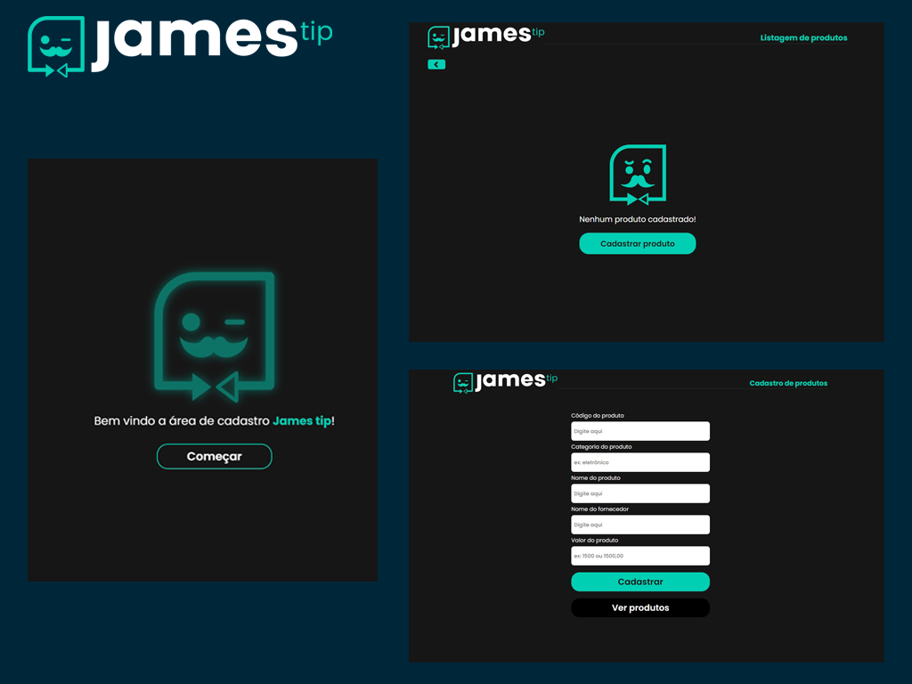

<p align="center">
  <a href="#-tecnologias">Tecnologias</a>&nbsp;&nbsp;&nbsp;|&nbsp;&nbsp;&nbsp;
  <a href="#-features">Features</a>&nbsp;&nbsp;&nbsp;|&nbsp;&nbsp;&nbsp;
  <a href="#-executando-o-projeto">Executando o projeto</a>&nbsp;&nbsp;&nbsp;
</p>

<br>

<p align="center">
  <a href="https://james-tip-pink.vercel.app/" target="_blank">Clique aqui</a> para acessar a versão web
</p>

<p align="center">
  
  
  
</p>

## 🖥️ Projeto

Se trata de um --projeto/teste técnico-- proposto pela James tip, no qual fui orientado a construir uma nova plataforma para os clientes cadastrarem produtos em um banco de dados e também uma página para visualização, edição e deleção dos produtos cadastrados.

## 📲 Tecnologias

Esse projeto foi desenvolvido com as seguintes tecnologias/bibliotecas:

<table border="0">
 <tr>
<td> Typescript</td>
<td> React.JS</td>
<td> Styled Components</td>
<td> contextAPI</td>
 </tr>
 <tr>
<td> React Toastify</td>
<td> React Router Dom</td>
<td> Framer-motion</td>
<td> <a href="https://www.figma.com/file/OuTJNjqwfgXZUyeUQfiYaB/James-Tip?node-id=0%3A1">Figma</a></td>

 </tr>
</table>

## 🌟 Features

-   [X] Adicionar, remover e excluir produtos;
-   [X] Responsividade - projeto realizado utilizando o conceito de mobile-first;
-   [X] Atualização em tempo real da lista de produtos;
-   [X] Dados dos produtos persistindo em localStorage;
-   [X] Renderização condicional das listas, para caso não houver nenhum item, será mostrado uma mensagem personalizada;

## 👨🏻‍💻 Executando o projeto

- 1º - clone o repositório para seu computador;
- 2º - no local clonado, abra o terminal e execute o **yarn** ou o **npm install** para instalar as dependências do projeto;
- 3º - abra o projeto com o comando ``` code . ```

Para acessar a versão web:

```cl
yarn start ou npm run dev
```
